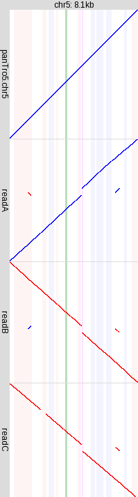

# local-rearrangements

Here are methods to find local rearrangements in DNA reads relative to
a genome sequence.  "Local" means intra-chromosomal rearrangements
that are encompassed by one read.

An example is shown on the right.  The top panel shows an alignment
(diagonal line) between an 8.1 kb chunk of human chromosome 5, and
chimp (panTro5) chromosome 5.  The lower panels show alignments of
three human DNA reads.  Each read base is aligned to at most one
genome base (this is guaranteed by `last-split`).

The DNA reads come randomly from either DNA strand: here, readA is
from the opposite strand to readB and readC.

readC's alignment seems to have missing parts: this might be due to
sequencing errors causing the aligner to drop those parts.  Perhaps
they could be rescued by re-aligning in a more slow-and-sensitive
mode.

The vertical stripes show human genome annotations: green = exon, pink
= forward-strand transposon, blue = reverse-strand transposon, purple
= low-complexity sequence.

## Limitations

There are no methods here to characterize rearrangements
automatically.  The approach is to make pictures of them, which a
human has to interpret.

## Simple usage

First, align your sequences as described
[here](https://github.com/mcfrith/last-rna/blob/master/last-long-reads.md).
Then, find rearrangements:

    local-rearrangements myseq.maf > out.maf

The output begins with lines like this:

    # Rearrangement: chr1 16088760 16089609 read217 read696
    # Rearrangement: chr4 32069345 32072990 read101 read333 read777

Each line includes the start and end coordinates of a rearranged
region (in [BED3][] format), followed by names of reads that have a
local rearrangement in this region.

[BED3]: https://genome.ucsc.edu/FAQ/FAQformat.html#format1

Next, the output has the alignments of the rearranged reads.

Finally, rearrangement counts are shown on the screen:

    # Rearrangements: 1383
    # Query sequences:  1   Rearrangements: 1258
    # Query sequences:  2   Rearrangements: 20
    # Query sequences:  3   Rearrangements: 13
    ...

This means there are 1383 rearranged regions, of which 1258 have just
one DNA read, 20 have two DNA reads, etc.

## Recommended usage

LAST's rearranged alignments work best when aligning a *derived query*
sequence to an *ancestral reference* sequence.  This is because
`last-split` seeks a unique best alignment for each part of the query:
so it allows for arbitrary deletions and duplications in the query
relative to the reference, but not vice-versa.

Thus, it is recommended to use an outgroup to check the ancestral
condition of each rearrangement.  If we are aligning human DNA reads
to a human genome, then a suitable outgroup would be chimp or gorilla.

Specifically, we need alignments between outgroup sequences and our
reference genome.  The outgroup sequences can be either assembled
genomes or unassembled reads.  If any outgroup sequence has an
un-rearranged alignment covering a rearrangement, then the reference
genome's arrangement is ancestral.

Alignments of chimp and gorilla to human genome hg38 are available
[here](https://github.com/mcfrith/last-genome-alignments).  We can
simply concatenate them:

    cat hg38-panTro5.tab hg38-gorGor5.tab > apes.tab

And then find rearrangements where the reference genome is ancestral:

    local-rearrangements --outgroup apes.tab myseq.maf > out.maf

## Re-aligning

Rearrangements are likely to be enriched for alignment errors.  So
it's wise to re-align potentially-rearranged reads more carefully.

First, let's extract all reads, whether rearranged or not, that are
near rearrangements (so these reads might be rearranged if we align
them more carefully):

    local-rearrangements --rearrangements out.maf --min-queries=2 myseq.maf > out2.maf

Here, we only consider rearrangements with at least two reads
(`--min-queries=2`).  In some datasets, it seems that: *many* reads
are rearranged due to (non-alignment) artifacts, and rearrangements
with at least two (or three) reads are more likely to be real.  By
omitting numerous artifactual cases, we can afford to re-align more
slowly-and-sensitively.

Next, get the FASTA sequences of these reads:

    fasta-from-maf out2.maf myseq.fa > redo.fa

Now, re-align these reads more carefully:

    lastal -P8 -m20 -p myseq.par mydb redo.fa | last-split -m1 > redo.maf

It's recommended to use a [non-repeat masked
`mydb`](https://github.com/mcfrith/last-rna/blob/master/last-long-reads.md)
here.  You can expect these alignments to be pretty accurate, but not
100% perfect (e.g. small rearranged fragments might be missing).  If
you're patient, you can be even more slow-and-sensitive:

    lastal -P8 -m50 -d90 -p myseq.par mydb redo.fa | last-split -m1 > redo.maf

Finally, get rearrangements from our careful alignments:

    local-rearrangements --outgroup apes.tab redo.maf > redone.maf
    local-rearrangements --rearrangements redone.maf redo.maf > redone2.maf

## local-rearrangement-pics

This draws pictures of the rearrangements:

    local-rearrangement-pics redone-pics redone.maf

This draws fancier pictures with genes and repeats:

    local-rearrangement-pics -g refGene.txt -R rmsk.txt redone-pics redone.maf

This shows all reads (including non-rearranged ones) that overlap the
rearranged regions:

    local-rearrangement-pics -g refGene.txt -R rmsk.txt -a redone2-pics redone2.maf

Showing all reads is more informative, but it can be more cluttered
and confusing.

## `local-rearrangements` options

- `-h`, `--help`: show a help message and exit.

- `--gap=FILE`: suppress rearrangements that overlap unsequenced gaps
  in the genome (making them unreliable).  If you use `--outgroup`
  then you probably don't need this.  `FILE` should contain gap
  locations in agp or gap.txt format.

- `--min-queries=N`: only consider rearrangements with >= N query
  sequences.

- `--outgroup=FILE`: read outgroup alignments in maf or lastTab
  format.  Output each rearrangement only if it is covered by a
  non-rearranged outgroup alignment.

- `--outgroup-max-gap=L`: maximum allowed length of any gap (insertion
  or deletion) in an outgroup alignment covering a rearranged region.

- `--rearrangements=FILE`: get alignments of queries near these
  rearrangements.

- `--tandem`: include simple tandem duplications.  These are (mostly)
  excluded by default, because there are lots of them, overwhelming
  more interesting cases.

- `-v`, `--verbose`: show progress messages.

## `local-rearrangement-pics` options

See also [last-dotplot](http://last.cbrc.jp/doc/last-dotplot.html),
which has many of the same options.

- `-h, --help`: show a help message with default option values, and exit.

- `-a`: show all reads at each rearrangement.  The default is to show
  just the (locally) rearranged reads.

- `-b FILE`:    read genome annotations from a BED file.

- `-f FILE`:    TrueType or OpenType font file.

- `-g FILE`:    read gene annotations from a genePred file.

- `-n NUM[+]`: restrict to cases with this many rearranged reads.
  E.g. `1` means exactly 1 rearranged read, whereas `2+` means 2 or
  more rearranged reads.

- `-o FILE`:    read outgroup alignments in maf or lastTab format.

- `-r COUNT`: get a (pseudo)random sample of this many rearrangements.
  **Useful** when there's a large number of rearrangements.

- `-R FILE`: read repeat annotations from a RepeatMasker .out or
  rmsk.txt file.

- `-s SIZE`:    font size.

- `-u FILE`:    read unsequenced gaps from an agp or gap file.

- `-U FILE`:    read outgroup unsequenced gaps from agp or gap file.

- `-x WIDTH`:   maximum width in pixels.

- `-y HEIGHT`:  maximum height in pixels.

- `-z FILE`: read a file with zoom-out percentages.  The pictures
  include left and right flanks of each rearrangement, and by default
  the flank length is 50% of the rearranged region length.  A zoom
  file should have lines like this:

        chr5 79750308 20

  The first two fields uniquely specify a rearrangement, by chromosome
  and start coordinate.  The third field is the zoom % to use for this
  rearrangement.
